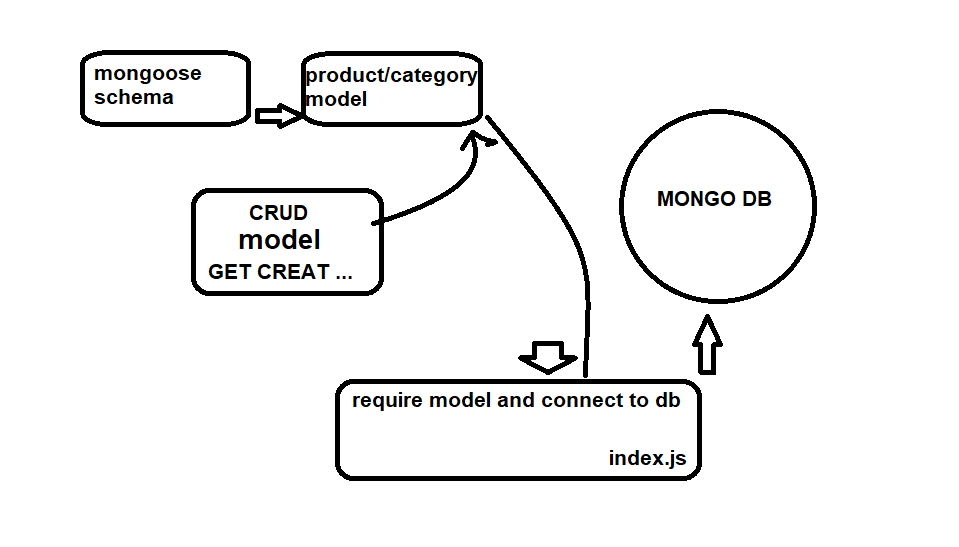

# LAB - Class 05

## Data Modeling With NoSQL Databases

### Author: obada alquran

### Links and Resources

- [submission PR](https://github.com/obadeh/401-lab-05/pull/1)
- [ci/cd](https://github.com/obadeh/401-lab-05/actions) (GitHub Actions)

### Setup

#### `.env` requirements (where applicable)

i.e.

- `PORT` - Port Number
- `MONGODB_URI` - URL to the running mongo instance/db

#### How to initialize/run your application (where applicable)

- e.g. `node index.js`

#### Tests

- How do you run tests?  `npm test`
- Any tests of note?
- Describe any tests that you did not complete, skipped, etc

#### UML

